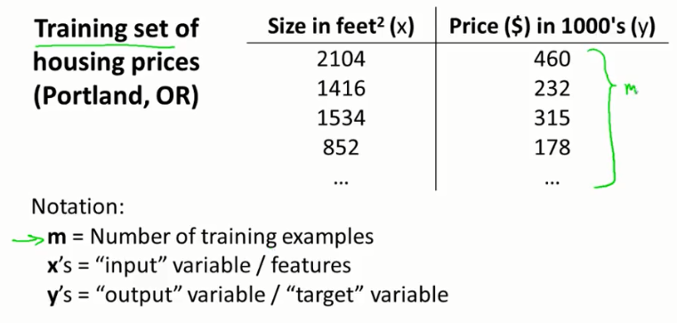
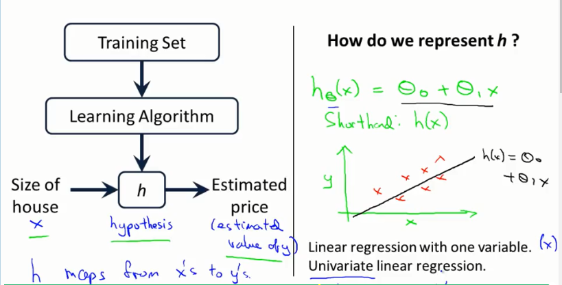
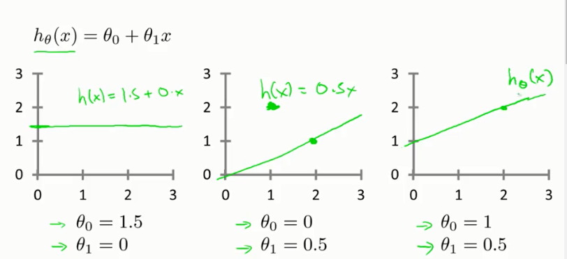

# 第一周的笔记
## 争取一天看完
## 入门
## 简单
## 以前看过一次了
## 使用weekone分支

## What is machine learning?
> Arth Samuel(1959). Maching learning: Field of study that gives computers the ability to learn without being explicitly programmed.

灵感来源于Samuel编写的西洋棋程序。

> Tom Mitchell(1998). Well-posed Learning Problem: A computer program is said to learn from experence E with respect to some task T and some performance measure P, if its performance on T, as measured by P, improves with experience E.

以西洋棋为例

> E= the experience of playing many games of checkers. 
> T= the task of playing checkers. 
> P= the probability that the program will win the next game.

## Machine learning algorithms:
* ***Supervised learning***
* ***Unsupervised learning***
* Reinforcement Learning
* Recommender systems

## SUPERVISED Learning

> In supervised learning, we are given a data set and already know what our correct output should look like, having the idea that there is a relationship between the input and the output.
有标签 

 
* 预测价格（连续的）叫做**回归Regression**
* 预测所属类别叫做**分类Classification**

## UNSUPERVISED Learning

> Unsupervised learning allows us to approach problems with little or no idea what
our results should look like. We can derive structure from data where we don't necessarily know the effect of the variables.
没有标签。

聚类 
鸡尾酒会算法 
SVD

## Model Representation

### Linar regression

## Cost Function
Training set $x^2$
| Size in $feet^2(x)$ | Price ($) in $1000's(y)$ |
| ------------------- | ------------------------ |
| 2104                | 460                      |
| 1416                | 232                      |
| 1534                | 315                      |
| 852                 | 178                      |
| ...                 | ...                      |

***Hypothesis***: $h_\theta(x)=\theta_0 + \theta_1x$
$\theta_i's$: Parameters

**Target:**
$${minmize\atop {\theta_0,\theta_1}}{\frac{1}{2m}}{\sum_{i=1\ldots m}}(h_\theta(x^{(i)})-y^{(i)})^2$$

**cost function $J(\theta_0,\theta_1)$:**

$$J(\theta_0,\theta_1)={\frac{1}{2m}}{\sum_{i=1\ldots m}}(h_\theta(x^{(i)})-y^{(i)})^2$$

**So the target is:**

$${minmize\atop {\theta_0,\theta_1}} {\underbrace{J(\theta_0,\theta_1)}_{cost function}}$$

> squared error function.
