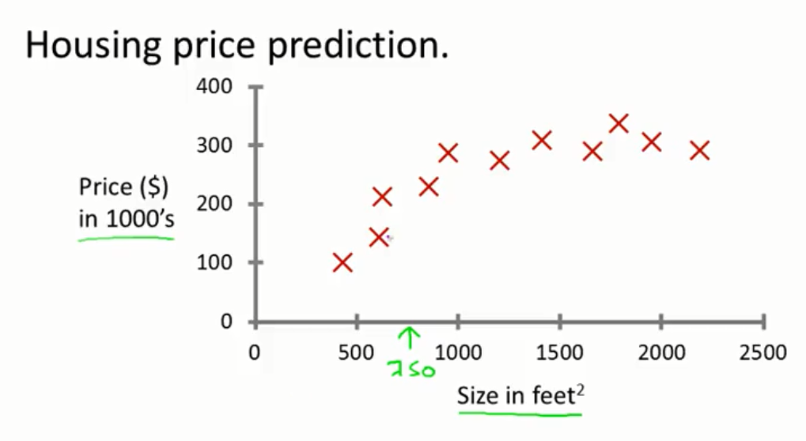
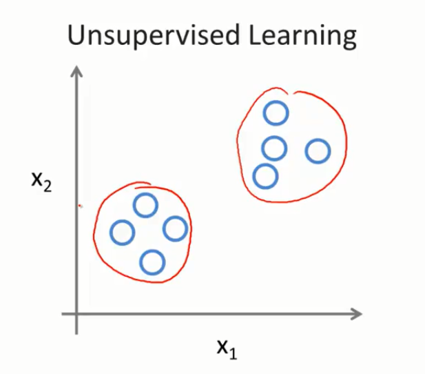

# 第一周的笔记
## 争取一天看完
## 入门
## 简单
## 以前看过一次了
## 使用weekone分支

## What is machine learning?
> Arth Samuel(1959). Maching learning: Field of study that gives computers the ability to learn without being explicitly programmed.

灵感来源于Samuel编写的西洋棋程序。

> Tom Mitchell(1998). Well-posed Learning Problem: A computer program is said to learn from experence E with respect to some task T and some performance measure P, if its performance on T, as measured by P, improves with experience E.

以西洋棋为例

> E= the experience of playing many games of checkers. 
> T= the task of playing checkers. 
> P= the probability that the program will win the next game.

## Machine learning algorithms:
* ***Supervised learning***
* ***Unsupervised learning***
* Reinforcement Learning
* Recommender systems

## SUPERVISED Learning

有标签 

 
* 预测价格（连续的）叫做**回归Regression**
* 预测所属类别叫做**分类Classification**

## UNSUPERVISED Learning
没有标签。

聚类 

